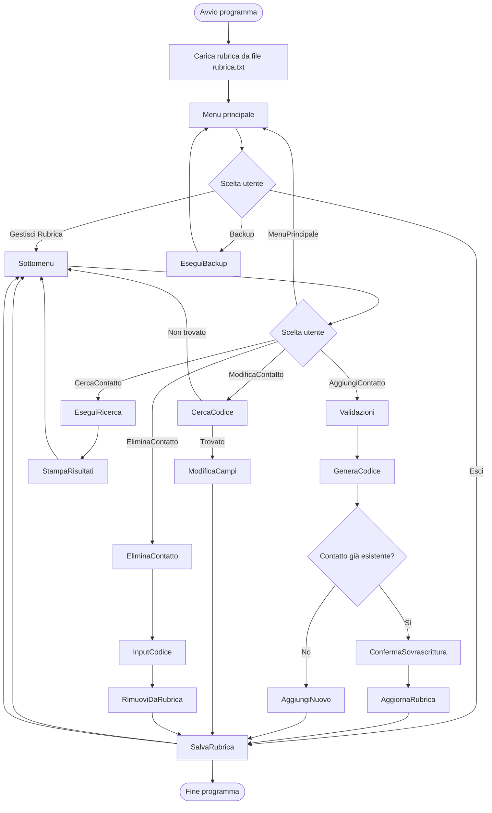
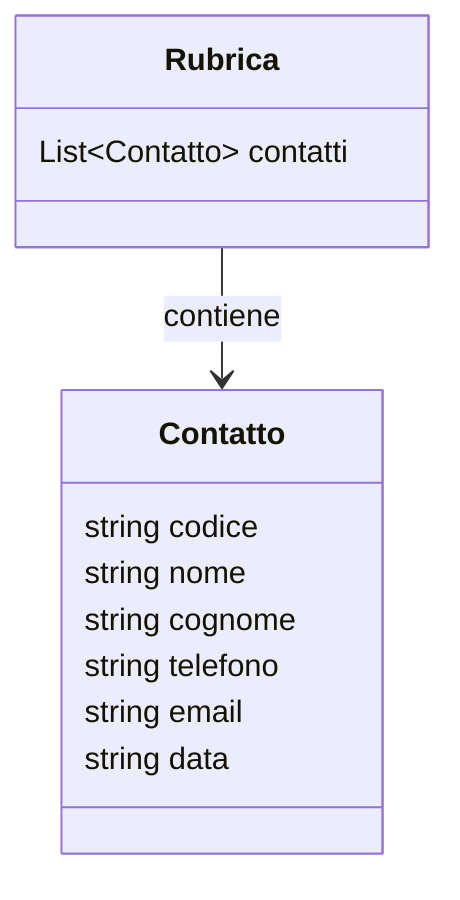

# RUBRICA TELEFONICA (V 1.0)

## Argomenti

- Creare un repository dedicato al progetto
- Creare un file README.md con le informazioni sul progetto

## Strutture di dati

- Dizionari per memorizzare dati (codice, nome, cognome, numero di telefono, email, data creazione contatto `datetime.now().strftime()`)
- Il codice deve essere formato dalle prime due lettere del nome le prime due del cognome e le ultime due cifre del numero di telefono (in maiuscolo)

## Gestione files
- Lettura e scrittura di file .txt
- Formattazione e parsing con split()
- Pulizia delle stringhe con strip()
- Backup del file dati principale (copiare il file in una catella backup con timestamp aggiunto al nome del file)

## Gestione di input utente
- Il programma non accetta nessun campo vuoto
- Implementazione di un menu principale con Backup Rubrica e Visualizza Rubrica
- Implementazione del sottomenu Visualizza Rubrica con le principali operazioni (Aggiungi, Modifica, Elimina, Cerca)
- Implementazione sottomenu cerca

## Gestione eccezioni
- Gestione delle eccezioni con isdigit o simili tipo che il nome deve essere di almeno 3 lettere
- Il numero di telefono deve evere 10 cifre
- La mail deve contenere il simbolo @
- I nomi ed i cognomi vengono modificati rispetto all inserimento dell utente in modo da avere le iniziali maiuscole
- Se un contatto esiste già, il programma deve chiedere se si vuole sovrascrivere

## Cerca contatti
- Permetti di cercare:
- parte del nome, dominio email, numeri che iniziano per, nomi che iniziano per

## Output
- Dopo ogni operazione, stampa a video lo stato della rubrica (numero contatti e riepilogo ultimi 3 aggiunti/modificati)
- Dopo che l utente effettua la ricerche, il programma deve stampare a video i risultati in modo ordinato e formattato usando \n \t
- Il programma deve stampare a video il numero di contatti presenti in rubrica

```python
import os
import shutil
from datetime import datetime

rubrica = []
FILE_RUBRICA = "rubrica.txt"
CARTELLA_BACKUP = "backup"

if not os.path.exists(CARTELLA_BACKUP):
    os.mkdir(CARTELLA_BACKUP)

# Caricamento iniziale dei dati
if os.path.exists(FILE_RUBRICA):
    with open(FILE_RUBRICA, "r", encoding="utf-8") as file:
        for riga in file:
            parti = riga.strip().split("|")
            if len(parti) == 6:
                contatto = {
                    "codice": parti[0],
                    "nome": parti[1],
                    "cognome": parti[2],
                    "telefono": parti[3],
                    "email": parti[4],
                    "data": parti[5]
                }
                rubrica.append(contatto)

print("RUBRICA TELEFONICA v1.0")

while True:
    print("\nMENU PRINCIPALE")
    print("1. Gestisci rubrica")
    print("2. Backup rubrica")
    print("3. Esci")
    scelta = input("Scelta: ").strip()

    if scelta == "1":
        while True:
            print("\nSOTTOMENU RUBRICA")
            print("1. Aggiungi contatto")
            print("2. Modifica contatto")
            print("3. Elimina contatto")
            print("4. Cerca contatto")
            print("5. Torna al menu principale")
            sub = input("Scelta: ").strip()

            if sub == "1":
                nome = input("Nome: ").strip().capitalize()
                cognome = input("Cognome: ").strip().capitalize()
                telefono = input("Numero di telefono (10 cifre): ").strip()
                email = input("Email: ").strip()

                if not nome or not cognome or not telefono or not email:
                    print("Errore: tutti i campi sono obbligatori.")
                    continue

                if len(nome) < 3 or len(cognome) < 3:
                    print("Errore: nome e cognome devono contenere almeno 3 lettere.")
                    continue

                if not telefono.isdigit() or len(telefono) != 10:
                    print("Errore: numero di telefono non valido.")
                    continue

                if "@" not in email:
                    print("Errore: email non valida.")
                    continue

                codice = (nome[:2] + cognome[:2] + telefono[-2:]).upper()
                data = datetime.now().strftime("%Y-%m-%d %H:%M:%S")
                esiste = False

                for contatto in rubrica:
                    if contatto["codice"] == codice:
                        print(f"Attenzione: il contatto con codice {codice} esiste già.")
                        conferma = input("Vuoi sovrascriverlo? (s/n): ").strip().lower()
                        if conferma == "s":
                            contatto.update({
                                "nome": nome,
                                "cognome": cognome,
                                "telefono": telefono,
                                "email": email,
                                "data": data
                            })
                            esiste = True
                        break

                if not esiste:
                    rubrica.append({
                        "codice": codice,
                        "nome": nome,
                        "cognome": cognome,
                        "telefono": telefono,
                        "email": email,
                        "data": data
                    })
                    print("Contatto aggiunto.")

                with open(FILE_RUBRICA, "w", encoding="utf-8") as file:
                    for c in rubrica:
                        file.write(f"{c['codice']}|{c['nome']}|{c['cognome']}|{c['telefono']}|{c['email']}|{c['data']}\n")

            elif sub == "2":
                codice = input("Codice del contatto da modificare: ").strip().upper()
                trovato = False
                for contatto in rubrica:
                    if contatto["codice"] == codice:
                        telefono = input("Nuovo numero di telefono: ").strip()
                        email = input("Nuova email: ").strip()
                        if not telefono.isdigit() or len(telefono) != 10 or "@" not in email:
                            print("Dati non validi.")
                            break
                        contatto["telefono"] = telefono
                        contatto["email"] = email
                        contatto["data"] = datetime.now().strftime("%Y-%m-%d %H:%M:%S")
                        print("Contatto aggiornato.")
                        trovato = True
                        break
                if not trovato:
                    print("Contatto non trovato.")

                with open(FILE_RUBRICA, "w", encoding="utf-8") as file:
                    for c in rubrica:
                        file.write(f"{c['codice']}|{c['nome']}|{c['cognome']}|{c['telefono']}|{c['email']}|{c['data']}\n")

            elif sub == "3":
                codice = input("Codice del contatto da eliminare: ").strip().upper()
                iniziale = len(rubrica)
                rubrica = [c for c in rubrica if c["codice"] != codice]
                if len(rubrica) < iniziale:
                    print("Contatto eliminato.")
                else:
                    print("Contatto non trovato.")

                with open(FILE_RUBRICA, "w", encoding="utf-8") as file:
                    for c in rubrica:
                        file.write(f"{c['codice']}|{c['nome']}|{c['cognome']}|{c['telefono']}|{c['email']}|{c['data']}\n")

            elif sub == "4":
                print("\nRICERCA CONTATTI")
                print("1. Parte del nome")
                print("2. Dominio email")
                print("3. Numero che inizia per")
                print("4. Nomi che iniziano per")
                scelta_ricerca = input("Scelta: ").strip()
                risultati = []

                if scelta_ricerca == "1":
                    parte = input("Parte del nome: ").strip().lower()
                    for c in rubrica:
                        if parte in c["nome"].lower():
                            risultati.append(c)

                elif scelta_ricerca == "2":
                    dominio = input("Dominio email (es. gmail.com): ").strip().lower()
                    for c in rubrica:
                        if c["email"].endswith(dominio):
                            risultati.append(c)

                elif scelta_ricerca == "3":
                    prefisso = input("Inizio numero: ").strip()
                    for c in rubrica:
                        if c["telefono"].startswith(prefisso):
                            risultati.append(c)

                elif scelta_ricerca == "4":
                    iniziali = input("Lettera iniziale del nome: ").strip().lower()
                    for c in rubrica:
                        if c["nome"].lower().startswith(iniziali):
                            risultati.append(c)

                print(f"\nContatti trovati: {len(risultati)}")
                for c in risultati:
                    print(f"\nCodice: {c['codice']}\n\tNome: {c['nome']} {c['cognome']}\n\tTelefono: {c['telefono']}\n\tEmail: {c['email']}\n\tData: {c['data']}")

            elif sub == "5":
                break

            print(f"\nContatti totali: {len(rubrica)}")
            print("Ultimi 3 contatti:")
            for c in rubrica[-3:]:
                print(f"  - {c['nome']} {c['cognome']} ({c['telefono']})")

    elif scelta == "2":
        timestamp = datetime.now().strftime("%Y%m%d_%H%M%S")
        nome_backup = f"{CARTELLA_BACKUP}/rubrica_BACKUP_{timestamp}.txt"
        with open(nome_backup, "w", encoding="utf-8") as file:
            for c in rubrica:
                file.write(f"{c['codice']}|{c['nome']}|{c['cognome']}|{c['telefono']}|{c['email']}|{c['data']}\n")
        print(f"Backup salvato in: {nome_backup}")

    elif scelta == "3":
        break

    else:
        print("Scelta non valida.")

# Salvataggio finale
with open(FILE_RUBRICA, "w", encoding="utf-8") as file:
    for c in rubrica:
        file.write(f"{c['codice']}|{c['nome']}|{c['cognome']}|{c['telefono']}|{c['email']}|{c['data']}\n")

print("Rubrica salvata. Programma terminato.")
```


