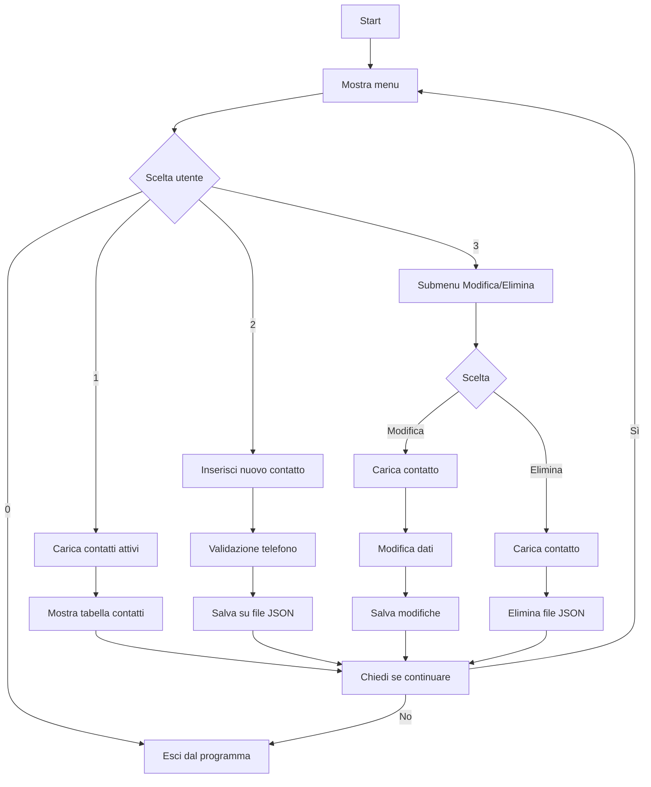

```markdown
# Rubrica Telefonica - Terminale

Una semplice rubrica telefonica da terminale scritta in Python, con interfaccia testuale usando `rich`. In questo proggetto non verranno usate delle nozioni avanzate come le funzioni, le classi.  

## Requisiti

- Python 3.7+
- Libreria `rich`

Installazione:
```bash
pip install rich
```

## creazione della cartella rubrica

```bash
python rubrica.py
```

## Funzionalità


-  Visualizza contatti attivi
-  Aggiungi nuovo contatto
-  Modifica contatto
-  Elimina contatto
-  Salvataggio locale in JSON

## Struttura File

Ogni contatto è salvato come un file `.json` nella cartella `contatti/`, con nome basato su Nome_Cognome.

---

## Diagramma di Flusso (Mermaid)



---

## Esempio di contatto (JSON)

```json
{
  "nome": "Mario",
  "cognome": "Rossi",
  "telefono": [
    {
      "tipo": "cellulare",
      "numero": "3331234567"
    }
  ],
  "attivita": ["cliente", "sviluppatore"],
  "note": "Contatto importante",
  "attivo": true,
  "data_creazione": "2025-04-17 15:00:00"
}
```

---

## Autore

```
